A toolkit for building wasm applications using TSX


```tsx
function Add() {
  const $a = <param.i32 />
  const $b = <param.i32 />
  const $ret = <result.i32 />
  return (
    <Func params={[$b, $a]} ret={$ret}>
      <local.get var={$a} />
      <local.get var={$b} />
      <i32.add />
    </Func>
  )
}
```

```ts
import Mod from "../example/add"
const wasm = await createWasm<{ Add: (a: number, b: number) => number }>(Mod)
const { Add } = wasm.exports
expect(Add(1, 2)).toBe(3)
expect(Add(11, 2)).toBe(13)
expect(Add(1, 12)).toBe(13)
```
## bench
In some scenarios, wasm is 10 times faster than js
<div align="center">
	<a href="https://github.com/ahaoboy/neofetch">
		
	</a>
</div>

## todo
- [ ] Automatic Dependency Collection